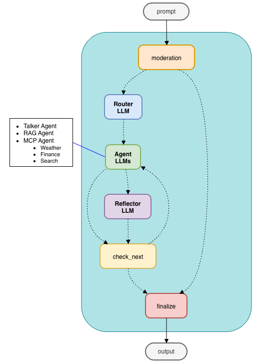
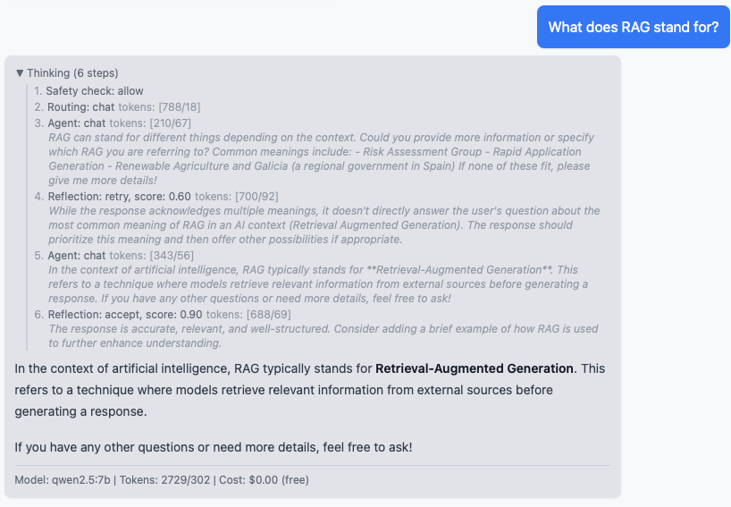
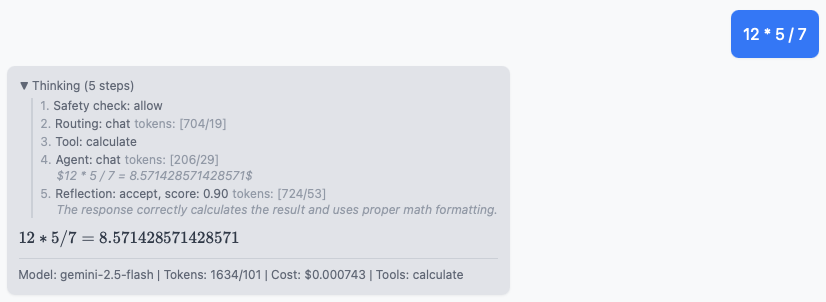

# LLM RAG MCP Orchestrator Chat Demo

A multi-agent chat system that combines RAG, tool calling (MCP), and self-reflection. Supports Ollama (local) and Gemini (cloud) simultaneously.

## Key Features

- **Multi-agent Orchestrator**: LangGraph-based workflow with specialized agents
- **Moderator**: Safety filter with pattern matching
- **Router**: Intent classification and routing to specialized agents
- **Tooluse**: Native LLM tool calling
- **MCP**: finance, weather, web search as discoverable services
- **RAG**: Local vector search with embeddings (cosine similarity)
- **Reflector**: Self-reflection with retry mechanism
- **Config**: YAML-based model and service registry
- **UI**: Real-time thinking with streaming responses (SSE)

<br>

<p align="center">
  
</p>

## Architecture

```
User ─► React UI ─► FastAPI (SSE) ─► Orchestrator (LangGraph)
            │                             │
        TypeScript             ┌──────────┼──────────┐
        Tailwind               ▼          ▼          ▼
                              RAG        MCP       Talker
                             Agent      Agents     Agent
                               │          │          │
                           embedding     MCP       Ollama,
                            vectors    services    Gemini
                         (Local data)  (FastMCP)  (Tool use)
                                          │
                               Finance, Weather, Tavily
```

**Orchestration flow:** Moderation → Routing → Agent execution → Reflection → Response

The orchestrator classifies each query, routes it to the right agent, and optionally reflects on the response quality before returning it. Multi-intent queries (e.g. "AAPL price and Tokyo weather") are split and handled sequentially.

<p align="center">
  
</p>

### Thinking UI & Reflection

The UI streams orchestration steps in real time via SSE — routing decisions, agent outputs, and reflection evaluations appear as they happen. The thinking section auto-collapses once the final answer arrives.

<p align="center">
  
</p>

### Native Tool Calling

The Talker agent supports LLM tool calling — tools are passed directly to the model and invoked automatically. Currently includes a sandboxed calculator; each tool call appears as a thinking step.

<p align="center">
  
</p>

### Model Notes

- **Gemini** follows tool-calling and formatting instructions more reliably but is subject to API rate limits on the free tier.
- **Ollama** (local) models like qwen2.5:7b may ignore formatting instructions (e.g. LaTeX delimiters) or produce less accurate routing. Larger local models generally perform better.

## Quick Start

### Prerequisites

- Python 3.12+
- Node.js 18+
- [uv](https://github.com/astral-sh/uv) (Python package manager)
- [Ollama](https://ollama.com/) (for local models)

### 1. Clone and pull models

```bash
git clone git@github.com:naokishibuya/llm-rag-chat-demo.git
cd llm-rag-chat-demo

ollama pull qwen2.5:7b
ollama pull gemma2:9b
ollama pull nomic-embed-text
```

Otherwise, the backend will auto-download ollama models on first use (which may take time).

### 2. Backend

```bash
cd backend
uv sync

# Optional: add API keys for Gemini / Tavily
cp .env.example .env

cd src
uv run uvicorn main:app --reload
```

API docs at http://localhost:8000/docs

### 3. MCP Services (optional)

Local finance and weather servers for tool-calling demos:

```bash
cd services
uv sync
uv run python -m mcp_services.finance.server &
uv run python -m mcp_services.weather.server &
```

Or run individually in separate terminals without sending to background (`&`).

[Tavily](https://tavily.com/) web search works out of the box if `TAVILY_API_KEY` is set in `backend/.env`.

### 4. Frontend

```bash
cd frontend
npm install
npm run dev
```

Open http://localhost:5173

## Configuration

All model and service config lives in `backend/config/config.yaml`. Each entry under `talk` becomes a selectable model in the UI dropdown:

```yaml
talk:
  - class: backend.llm.ollama.OllamaChat
    model: qwen2.5:7b
    temperature: 0.5

  - class: backend.llm.gemini.GeminiChat
    model: gemini-2.5-flash
    temperature: 0.5
    api_key_env: GEMINI_API_KEY

  - class: backend.llm.anthropic.AnthropicChat
    model: claude-haiku-4-5-20251001
    temperature: 0.5
    api_key_env: ANTHROPIC_API_KEY
...
```

Models requiring API keys are excluded from the UI selectors when credentials are missing.

## Project Structure

```
backend/
  config/config.yaml         # Models, pricing, MCP endpoints
  src/main.py                # FastAPI entrypoint
  src/backend/
    api.py                   # REST endpoints
    orchestrator/            # LangGraph state machine
      orchestrator.py        #   Lifecycle (startup/shutdown/stream)
      nodes.py               #   Graph state, node functions, graph builder
      router.py              #   Intent classification
      reflector.py           #   Response quality check
      moderator.py           #   Safety filter
      services.py            #   MCP service registry
    rag/                     # RAG agent (numpy vector search)
    mcp/                     # MCP agent (tool calling)
    talk/                    # General conversation agent
    llm/                     # Provider abstraction (Ollama, Gemini)
frontend/                    # React + TypeScript + Tailwind
services/                    # MCP servers (finance, weather)
data/                        # Documents for RAG indexing
```
