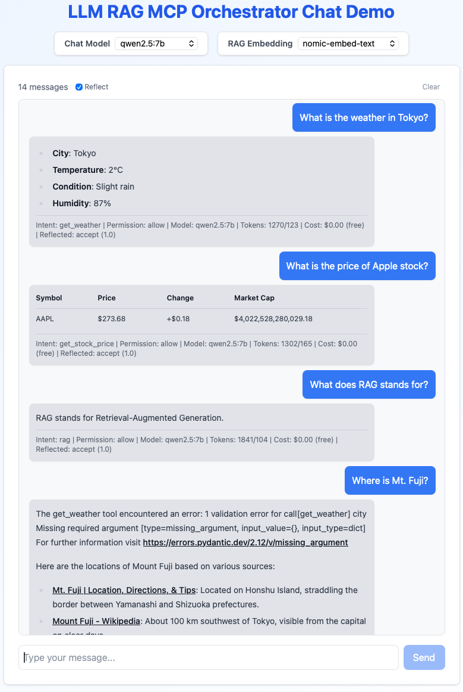

# LLM RAG MCP Orchestrator Chat Demo

A multi-agent chat system that combines RAG, tool calling (MCP), and self-reflection. Supports Ollama (local) and Gemini (cloud) simultaneously.



## Architecture

```
User ─► React UI ─► FastAPI ─► Orchestrator (LangGraph)
                                    │
                        ┌───────────┼───────────┐
                        ▼           ▼           ▼
                    RAG Agent   MCP Agents   Talker Agent
                        │           │
                   Vector Search   MCP Servers
                   (numpy)     (Finance, Weather, Tavily)
```

**Orchestration flow:** Safety check → Intent routing → Agent execution → Reflection → Response

The orchestrator classifies each query, routes it to the right agent, and optionally reflects on the response quality before returning it. Multi-intent queries (e.g. "AAPL price and Tokyo weather") are split and handled sequentially.

## Quick Start

### Prerequisites

- Python 3.12+
- Node.js 18+
- [uv](https://github.com/astral-sh/uv) (Python package manager)
- [Ollama](https://ollama.com/) (for local models)

### 1. Clone and pull models

```bash
git clone git@github.com:naokishibuya/llm-rag-chat-demo.git
cd llm-rag-chat-demo

ollama pull qwen2.5:7b
ollama pull gemma2:9b
ollama pull nomic-embed-text
```

Otherwise, the backend will auto-download ollama models on first use (which may take time).

### 2. Backend

```bash
cd backend
uv sync

# Optional: add API keys for Gemini / Tavily
cp .env.example .env

cd src
uv run uvicorn main:app --reload
```

API docs at http://localhost:8000/docs

### 3. MCP Services (optional)

Local finance and weather servers for tool-calling demos:

```bash
cd services
uv sync
uv run python -m mcp_services.finance.server &
uv run python -m mcp_services.weather.server &
```

[Tavily](https://tavily.com/) web search works out of the box if `TAVILY_API_KEY` is set in `backend/.env`.

### 4. Frontend

```bash
cd frontend
npm install
npm run dev
```

Open http://localhost:5173

## Configuration

All model and service config lives in `backend/config/config.yaml`:

```yaml
chat:
  - class: backend.llm.ollama.OllamaChat
    model: qwen2.5:7b
  - class: backend.llm.gemini.GeminiChat
    model: gemini-2.5-flash
    api_key_env: GEMINI_API_KEY

embeddings:
  - class: backend.llm.ollama.OllamaEmbeddings
    model: nomic-embed-text

mcp_services:
  finance:
    url: http://127.0.0.1:8030/mcp
  weather:
    url: http://127.0.0.1:8031/mcp
  tavily:
    url: https://mcp.tavily.com/mcp/?tavilyApiKey=${TAVILY_API_KEY}
```

Models requiring API keys are excluded from the UI selectors when credentials are missing.

## Project Structure

```
backend/
  config/config.yaml         # Models, pricing, MCP endpoints
  src/main.py                # FastAPI entrypoint
  src/backend/
    api.py                   # REST endpoints
    orchestrator/            # LangGraph state machine
      orchestrator.py        #   Graph builder + invoke
      router.py              #   Intent classification
      reflector.py           #   Response quality check
      moderator.py           #   Safety filter
      state.py               #   Shared state schema
    rag/                     # RAG agent (numpy vector search)
    mcp/                     # MCP agent (tool calling)
    talk/                    # General conversation agent
    llm/                     # Provider abstraction (Ollama, Gemini)
frontend/                    # React + TypeScript + Tailwind
services/                    # MCP servers (finance, weather)
data/                        # Documents for RAG indexing
```
