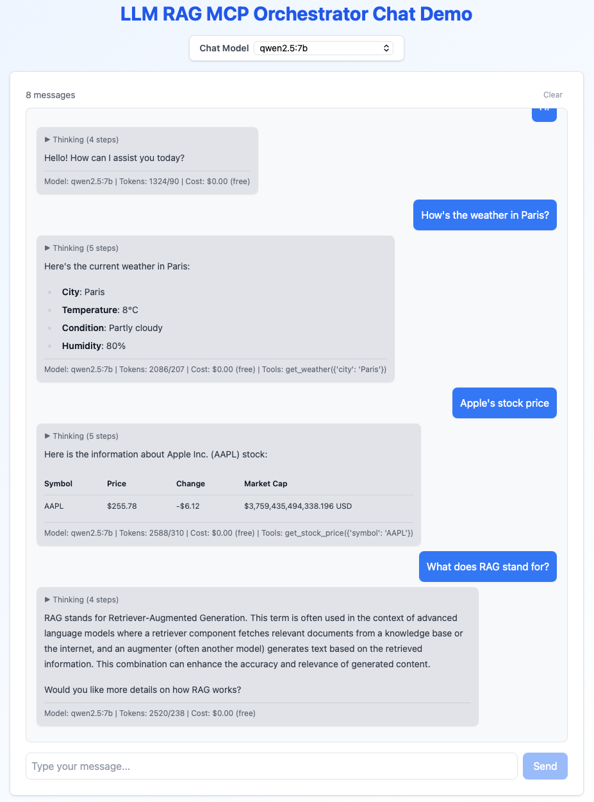
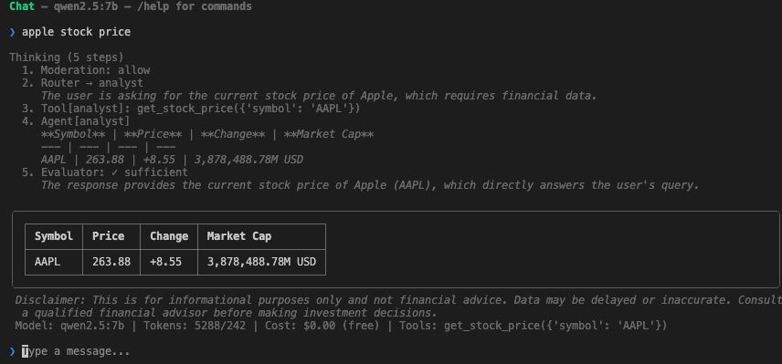
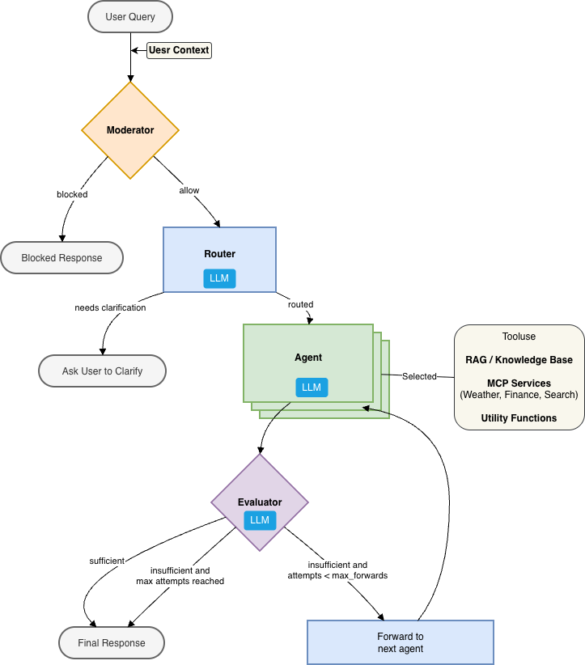
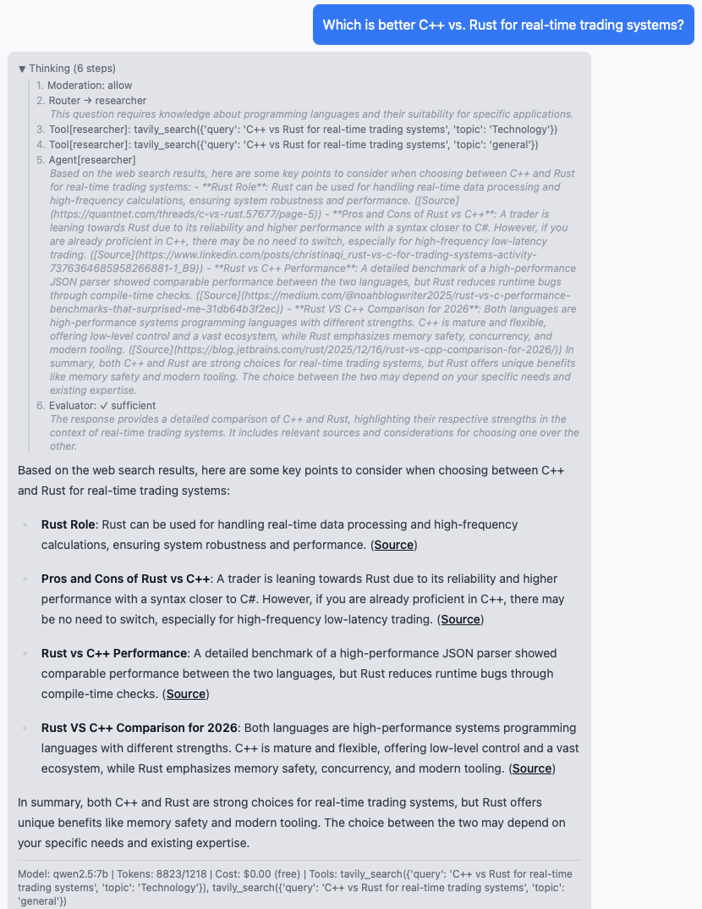
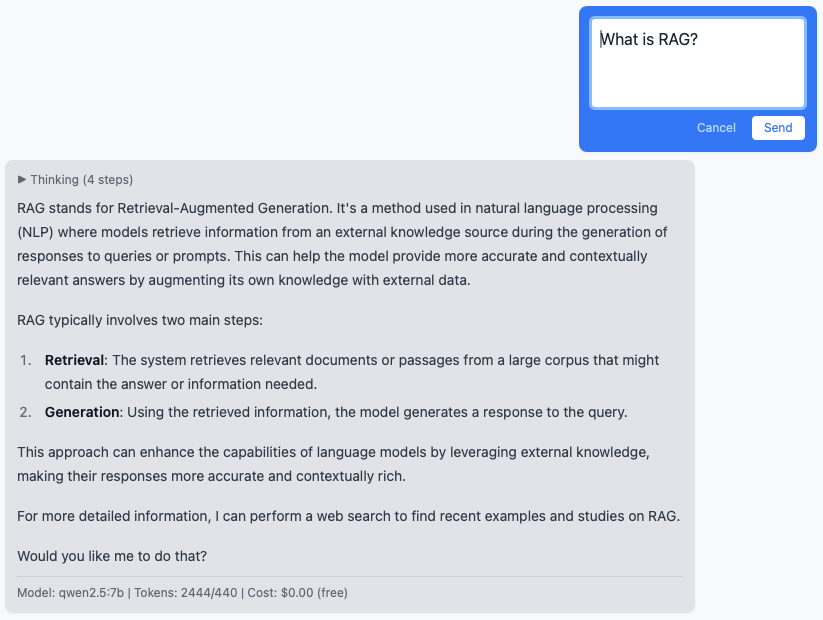
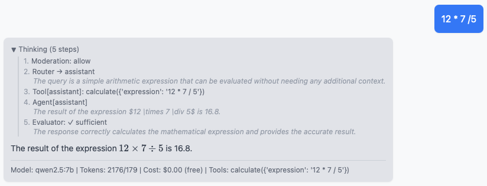

# LLM Multi-Agent Chat Demo

A multi-agent chat system with configurable agents, tool calling (MCP), RAG, and real-time streaming. Supports multiple LLM providers: Ollama (local), Gemini, Claude, and ChatGPT.

## Key Features

- **Agents**
  - YAML-driven — define roles, system prompts, and allowed tools in config
  - Multi-provider LLM — Ollama (local), Gemini, Claude, ChatGPT with unified `Chat` protocol
  - Tool calling — agents access all capabilities as tools (calculator, time, user context, RAG, MCP)
  - MCP — finance, weather, web search exposed as tools via FastMCP
  - RAG — topic-aware local vector search with embeddings, exposed as a tool
- **Orchestration**
  - Router — LLM-based intent classification, picks the best agent
  - Evaluator — judges response quality, forwards to another agent if needed
  - Moderator — safety filter with pattern matching
- **UI**
  - Real-time thinking steps with streaming responses (SSE)
  - Multi-turn chat with full conversation history
  - Edit-and-restart earlier messages

<br>

<p align="center">
  
</p>

- **CLI**
  - Interactive CLI with markdown rendering, syntax highlighting, and thinking spinner

<br>

<table align="center" border="1"  width="700">
  <tr>
    <td align="center">
      <br>
      
      <br><br>
    </td>
  </tr>
</table>

## Architecture

- **Frontend** — React + TypeScript + Tailwind, streams orchestration events via SSE
- **CLI** — React + Ink (terminal UI), same SSE streaming as the web frontend
- **Backend** — FastAPI, stateless (receives full message history each request)
- **Orchestrator** — async generator that coordinates the pipeline:
  1. **Moderator** — blocks unsafe queries (pattern matching)
  2. **Router** — LLM call to classify intent and pick the best agent
  3. **Agent** — LLM call with filtered tools (each agent only sees its allowed tools)
  4. **Evaluator** — LLM call to judge response quality; forwards to another agent if insufficient (up to `max_forwards` attempts)
- **Agents** — defined in YAML config with a role, system prompt, and tool list (assistant, knowledge, researcher, analyst, weather_expert)
- **Tools** — calculator, time, user context, RAG search, and MCP services (finance, weather, Tavily web search)

<br>

<p align="center">
  
</p>

### Thinking UI & Streaming

The UI streams orchestration steps in real time via SSE — routing decisions, tool calls, agent outputs, and evaluation results appear as they happen. The thinking section auto-collapses once the final answer arrives.

<p align="center">
  
</p>

### Multi-turn Chat & Edit

The chat supports full multi-turn conversations. You can also edit any earlier user message — the conversation restarts from that point with the edited text.

<p align="center">
  
</p>

### Tool Calling

Agents use native LLM tool calling — tools are defined as plain functions and passed directly to the model. Each tool call appears as a thinking step.

<p align="center">
  
</p>

### Model Notes

- **Gemini / Claude / ChatGPT** follow tool-calling and formatting instructions more reliably but are subject to API rate limits.
- **Ollama** (local) models like qwen2.5:7b may ignore formatting instructions (e.g. LaTeX delimiters) or produce less accurate routing. Larger local models generally perform better.

## Quick Start

### Prerequisites

- Python 3.12+
- Node.js 18+
- [uv](https://github.com/astral-sh/uv) (Python package manager)
- [Ollama](https://ollama.com/) (for local models)

### 1. Clone and pull models

```bash
git clone git@github.com:naokishibuya/llm-rag-chat-demo.git
cd llm-rag-chat-demo

ollama pull qwen2.5:7b
ollama pull nomic-embed-text
```

Otherwise, the backend will auto-download ollama models on first use (which may take time).

### 2. Backend

```bash
cd backend
uv sync

# Optional: add API keys for Gemini / Claude / OpenAI / Tavily
cp .env.example .env

cd src
uv run uvicorn main:app --reload
```

API docs at http://localhost:8000/docs

### 3. MCP Services (optional)

Local finance and weather servers for tool-calling demos:

```bash
cd services
uv sync
uv run python -m mcp_services.finance.server &
uv run python -m mcp_services.weather.server &
```

Or run individually in separate terminals without sending to background (`&`).

[Tavily](https://tavily.com/) web search works out of the box if `TAVILY_API_KEY` is set in `backend/.env`.

### 4. Frontend

```bash
cd frontend
npm install
npm run dev
```

Open http://localhost:5173

### 5. CLI (alternative to web frontend)

```bash
cd cli
npm install
npm run build

# Interactive chat (prompts for model selection)
npx chat-cli

# With a specific model
npx chat-cli --model gemini-2.5-flash

# Custom backend URL
npx chat-cli --server http://remote:8000

# List available models
npx chat-cli models
```

In-session commands: `/model` (switch model), `/clear` (reset history), `/quit` (exit), `/help`

## Configuration

All config lives in `backend/config/config.yaml`.

### Agents

Agents are defined declaratively — each has a role (used by the router), a system prompt, and a list of allowed tools:

```yaml
agents:
  assistant:
    role: "General chat, greetings, simple questions, time, math"
    system_prompt: |
      You are a helpful, friendly assistant.
      Be concise but informative. If you don't know something, say so rather than making things up.
    tools: [get_current_time, get_user_context, calculate]

  knowledge:
    role: "Questions about space, history, geography — topics in the local knowledge base"
    system_prompt: |
      You are a knowledge base specialist.
      Search the knowledge base to answer questions. Cite sources when available.
      If the knowledge base has no relevant results, say so.
    tools: [search_knowledge_base]

  researcher:
    role: "General research, technical questions, how-to guides, current events, and anything not covered by other agents"
    system_prompt: |
      You are a research specialist.
      Use web search to find accurate, up-to-date information.
      Cite sources with links when available. Be thorough but concise.
    tools: [tavily_search]

  analyst:
    role: "Finance, stocks, market data, and financial calculations"
    system_prompt: |
      You are a senior financial analyst with deep expertise in equity research.
      When answering complex financial questions:
      1. Break the question into research steps — gather price, ratios, financials as needed.
      2. Use multiple tools to cross-validate findings (e.g. check both ratios and income trends).
      3. Present data clearly in markdown tables when comparing numbers.
      4. Provide structured analysis: key metrics, bull case, bear case, and a summary.
      5. Always cite which data points support your conclusions.
      Be precise with numbers. Never fabricate data — only report what the tools return.
    tools: [get_stock_price, get_income_statement, get_balance_sheet, get_cash_flow, get_historical_prices, get_company_info, get_key_ratios, compare_stocks, calculate]
    disclaimer: "This is for informational purposes only and not financial advice."

  weather_expert:
    role: "Weather queries, forecasts, conditions"
    system_prompt: |
      You are a weather specialist.
      Provide clear, concise weather information.
      Include relevant details like temperature, conditions, and forecasts.
    tools: [get_weather, get_user_context]
```

### LLMs

Entries under `llm` become selectable models in the UI dropdown:

```yaml
llm:
  - class: backend.agent.llm.ollama.OllamaChat
    model: qwen2.5:7b
    params:
      temperature: 0.3
  - class: backend.agent.llm.gemini.GeminiChat
    model: gemini-2.5-flash
    api_key_env: GEMINI_API_KEY
    params:
      temperature: 0.3
  - class: backend.agent.llm.anthropic.AnthropicChat
    model: claude-haiku-4-5-20251001
    api_key_env: ANTHROPIC_API_KEY
    params:
      temperature: 0.3
  - class: backend.agent.llm.openai.OpenAIChat
    model: gpt-4.1-nano
    api_key_env: OPENAI_API_KEY
    params:
      temperature: 0.3
```

Models requiring API keys are excluded from the UI when credentials are missing.

### Workflow

```yaml
workflow:
  max_forwards: 2  # Max agent-to-agent forwards per query
```

### Pricing

The `pricing` section defines per-model token costs ($ per 1M tokens) used for usage tracking in the UI. These may differ from actual provider pricing. Local models default to zero.

## Project Structure

```
backend/
  config/config.yaml           # Agents, LLMs, MCP endpoints, RAG, pricing
  knowledge/                   # Documents for RAG indexing (by topic)
    space/                     #   Solar system, space exploration
    history/                   #   Ancient civilizations, modern history
    geography/                 #   Countries, landmarks, natural wonders
  src/main.py                  # FastAPI entrypoint
  src/backend/
    agent/                     # Agent framework
      agent.py                 #   Agent class (name, system_prompt, act)
      tools.py                 #   Tool definitions, build_tools, filter_tools
      types.py                 #   Chat/Agent protocols, Message, Reply, UserContext
      llm/                     #   Provider implementations (Ollama, Gemini, Anthropic, OpenAI)
        registry.py            #   Model registry, resolve by name
        pricer.py              #   Token cost calculator
      mcp/                     #   MCP client and tool handler
      rag/                     #   RAG client (numpy vector search, topic-aware)
    orchestrator/              # Orchestration pipeline
      orchestrator.py          #   Lifecycle (startup/shutdown), stream generator
      router.py                #   LLM-based intent classification
      evaluator.py             #   Response sufficiency check, agent forwarding
      moderator.py             #   Safety filter
    config.py                  # YAML config loader
    api.py                     # REST/SSE endpoints
frontend/                      # React + TypeScript + Tailwind
cli/                           # Interactive terminal UI (React + Ink)
services/                      # MCP servers (finance, weather)
```

## Disclaimer

The financial analysis features in this project are for **educational and demonstration purposes only**. Nothing produced by the analyst agent constitutes financial advice, investment recommendations, or endorsements. Financial data may be delayed, incomplete, or inaccurate. Always consult a qualified financial advisor before making investment decisions.
